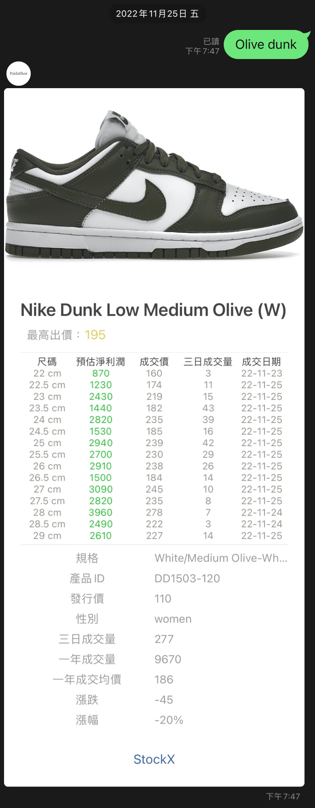
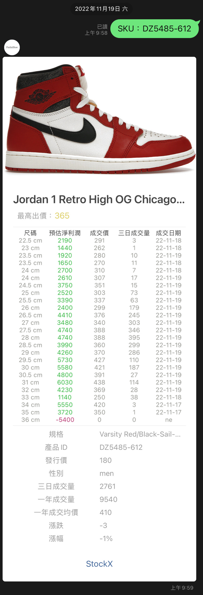

<figcaption>Developed by <a href="https://github.com/Patrick0105">@Patrick Fang</a></figcaption>
<br/>--設計流程分享
<br />
<br />
<p align="center">
  <a href="https://github.com/Patrick0105/StockX-Master">
    
  </a>
  
  <h3 align="center">『 StockX Master 』</h3>
  <div align="center">
  
  </div>
  <p align="center">
    一款查詢 StockX 網站上的潮流鞋款價格，並依據買賣價進行利潤分析，最後推送有 UI 介面的 Line Bot 的服務
    <br />
    <a href="https://github.com/Patrick0105/StockX-Master/issues">Report Bug</a>
    ·
    <a href="https://github.com/Patrick0105/StockX-Master/issues">Request Feature</a>
  </p>

 

<br />

看完後覺得有收穫，可以給點個 ⭐**星號** ，謝謝你的支持

## 服務展示

查詢鞋款時，不論輸入**鞋款型號**或**鞋款名稱**或**鞋款關鍵字**都可以執行，不限品牌。<br>
程式在接收到查詢請求後，會根據**當下**利潤計算後回傳**淨利潤**
>利潤計算會依據匯率、平台手續費、運費、出金費用、成交量與最高買價 (保證賣得掉的價格) 等等因素做判斷。

程式除了回傳相關利潤，亦會顯示近日**成交量**、**成交日期**、**漲幅**、**漲跌**、**溢價比**、**亞洲地區鞋碼自動轉換** 等等相關功能。


<p align="center">
  
  
  
</p>


## 開發緣由
近年來，潮流鞋款在市場上越來越受到關注，許多人對於最新的潮流鞋款價格十分關心。然而，由於潮流鞋款價格的變動頻繁，很難維持最新的資訊。因此，我們決定開發一個Line Bot，可以讓用戶隨時隨地查詢潮流鞋款的價格。

我們選擇使用StockX作為我們的數據來源，因為StockX是一個專門銷售潮流鞋款的網站，擁有大量的商品和價格資料。我們使用Python爬蟲技術獲取StockX的數據，並且進行一連串資料處理後，使用Line Bot SDK將資訊回覆給用戶。

我們希望這個Line Bot可以幫助潮流鞋款愛好者第一時間獲取最新的價格資訊，並且方便用戶隨時隨地查詢。


## 程式說明
1. 首先，我們看 Procfile 檔案，這個檔案是 Heroku 環境下執行程式的指令，在這個檔案中只有一行程式碼：
```
web: python app.py
```
這行程式碼告訴 Heroku 我們的主程式是 app.py，並且是一個 web 服務。

2. 接著，在 app.py 檔案中，我們使用 Flask 套件建立了一個 Flask 服務，並且使用 Line Bot SDK 套件，設定了一個 Webhook。
當用戶在 Line 上傳送文字給 Bot 時，Bot 會收到請求並且執行回覆。
我們使用 jsonhandle.py 這個檔案中的函數來查詢 StockX 網站上的價格，並且回覆給用戶。
```
@handler.add(MessageEvent, message=TextMessage)
def ReplyPrice(event):
    jsonhandle.jsonget(query=event.message.text)
    line_bot_api.reply_message(
        event.reply_token,
        FlexSendMessage(jsonhandle.stockxTitle,jsonhandle.productmsg)
        )
```
這段程式碼是當用戶在Line上傳送文字給Bot時，Bot會執行的回覆部分。
我們使用@handler.add(MessageEvent, message=TextMessage)這行程式碼註冊了一個函數ReplyPrice，當用戶傳送文字給Bot時，這個函數會被觸發。

在ReplyPrice函數中，我們首先使用jsonhandle.jsonget(query=event.message.text)呼叫jsonhandle.py中的jsonget函數，傳入用戶傳送的文字作為查詢關鍵字。

3. 接著，我們使用line_bot_api.reply_message(event.reply_token, FlexSendMessage(jsonhandle.stockxTitle,jsonhandle.productmsg))將查詢得到的商品標題和資訊回覆給用戶。
這段程式碼是使用jsonhandle.py中的函數查詢StockX網站上的價格並回覆給用戶的核心部分。
<br>
4. requirements.txt檔案：這個檔案中列出了我們專案所需要的套件。在這個專案中，我們使用了line-bot-sdk、Flask、requests三個套件。

## 討論

歡迎使用 [Github Issue](https://github.com/Patrick0105/StockX-Master/issues) <br/><br/>

## 特別感謝
會陪我一起收到 **未中獎** 簡訊的朋友🥲

## License

Distributed under the MIT License. See ```LICENSE``` for more information.
<br><br>
<hr>
<figcaption>Developed by <a href="https://github.com/Patrick0105">@Patrick Fang</a></figcaption>
<br/>--Design process sharing
<br />
<br />
<p align="center">
   <a href="https://github.com/Patrick0105/StockX-Master">
     
   </a>
  
   <h3 align="center">『StockX Master』</h3>
   <div align="center">
   
   </div>
   <p align="center">
     A service that checks the price of trendy shoes on the StockX website, conducts profit analysis based on the buying and selling price, and finally pushes the Line Bot service with UI interface
     <br />
     <a href="https://github.com/Patrick0105/StockX-Master/issues">Report Bug</a>
     ·
     <a href="https://github.com/Patrick0105/StockX-Master/issues">Request Feature</a>
   </p>

 

<br />

After reading it, I feel that I have gained something. You can give it a ⭐**star**, thank you for your support

## Service Display

When querying shoes, it can be executed regardless of the input of **shoe model** or **shoe name** or **shoe keywords**, regardless of the brand. <br>
After the program receives the query request, it will calculate the **current** profit and return **net profit**
>Profit calculation will be judged based on factors such as exchange rate, platform handling fee, shipping fee, withdrawal fee, transaction volume, and the highest purchase price (guaranteed selling price).

In addition to returning relevant profits, the program will also display the recent **trading volume**, **transaction date**, **increase**, **ups and downs**, **premium ratio**, **shoes in Asia Code automatic conversion** and other related functions.


<p align="center">
   
   
   
</p>


## Reason for Development
In recent years, trendy shoes have attracted more and more attention in the market, and many people are very concerned about the prices of the latest trendy shoes. However, due to the frequent price changes of trendy shoes, it is difficult to maintain the latest information. Therefore, we decided to develop a Line Bot that allows users to check the prices of trendy shoes anytime, anywhere.

We chose to use StockX as our data source because StockX is a website that specializes in selling trendy shoes and has a large amount of product and price information. We use Python crawler technology to obtain StockX data, and after a series of data processing, use Line Bot SDK to reply the information to users.

We hope that this Line Bot can help trendy shoe lovers get the latest price information at the first time, and it is convenient for users to inquire anytime and anywhere.


## Program Description
1. First, let’s look at the Procfile file. This file is the command to execute the program in the Heroku environment. There is only one line of code in this file:
```
web:python app.py
```
This line of code tells Heroku that our main program is app.py and is a web service.

2. Next, in the app.py file, we use the Flask package to create a Flask service, and use the Line Bot SDK package to set up a Webhook.
When a user sends text to the Bot on Line, the Bot will receive the request and execute the response.
We use functions in the jsonhandle.py file to query prices on the StockX website and respond to the user.
```
@handler.add(MessageEvent, message=TextMessage)
def ReplyPrice(event):
     jsonhandle.jsonget(query=event.message.text)
     line_bot_api.reply_message(
         event.reply_token,
         FlexSendMessage(jsonhandle. stockxTitle, jsonhandle. productmsg)
         )
```
This code is the reply part that the Bot will execute when the user sends text to the Bot on Line.
We use @handler.add(MessageEvent, message=TextMessage) to register a function ReplyPrice, which will be triggered when the user sends text to the Bot.

In the ReplyPrice function, we first use jsonhandle.jsonget(query=event.message.text) to call the jsonget function in jsonhandle.py, and pass in the text sent by the user as the query keyword.

3. Next, we use line_bot_api.reply_message(event.reply_token, FlexSendMessage(jsonhandle.stockxTitle,jsonhandle.productmsg)) to reply the query product title and information to the user.
This code is the core part of using the functions in jsonhandle.py to query the price on the StockX website and reply to the user.
<br>
4. requirements.txt file: This file lists the packages required by our project. In this project, we used three packages: line-bot-sdk, Flask, and requests.

## Discuss

Welcome to [Github Issue](https://github.com/Patrick0105/StockX-Master/issues) <br/><br/>

## Thanks
Friends who will accompany me to receive **Not Winning** text messages🥲

## License

Distributed under the MIT License. See ```LICENSE``` for more information.
<br><br>
<hr>
